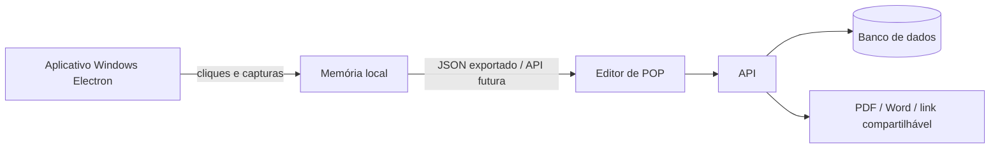

# Arquitetura do MVP — aplicativo Windows

## Limites da primeira fase

- O aplicativo captura cliques globais pelo Windows e captura a tela no momento de cada clique.
- Nesta versão, a proteção de dados é feita pela revisão: exclua etapas que contenham senhas, CPF, CNPJ, e-mail ou outras informações sigilosas antes de exportar.
- A publicação, controle de acesso, versionamento remoto e exportações entram depois da validação da gravação local.

## Entidades previstas

- Empresa
- Biblioteca / departamento
- Processo
- POP
- Versão do POP
- Etapa
- Anexo de imagem
